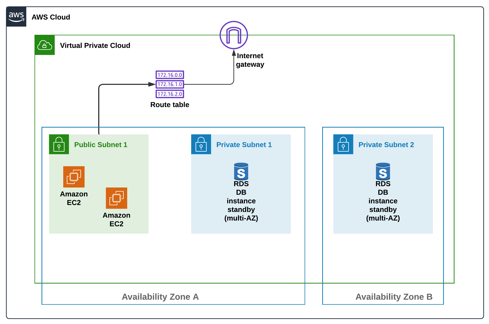

# 3 Tier Custom Terraform AWS VPC Module

This project demonstrates the deployment of a 3-tier architecture on Amazon Web Services (AWS) using Terraform modules.

## Project Video

###### <--- Comming Soon --->

## Architectural Diagram

## Overview

The `3-Tier-Project` directory contains the main Terraform configuration for provisioning the infrastructure. It includes modules for configuring the application load balancer, EC2 instances, RDS instances, security groups, and VPC settings.

### Modules

- **app-lb:** Configures the application load balancer.
- **ec2-instance:** Defines EC2 instances with associated configurations and user data scripts.
- **rds:** Sets up RDS instances for database requirements.
- **sg:** Manages security groups to control traffic access.
- **vpc:** Configures the Virtual Private Cloud (VPC) settings.

## State Backend

The `state-backend` directory contains configurations for the Terraform state backend, including setting up an S3 bucket and DynamoDB table for state management and locking.

Ensure that Terraform has the necessary permissions to access the S3 bucket and DynamoDB table for storing and locking the state file securely.

## Requirements

| Name                                                   | Version |
| ------------------------------------------------------ | ------- |
|  [aws](#requirement_aws) | 5.38.0  |

## Modules

| Name                                                                    | Source                 | Version |
| ----------------------------------------------------------------------- | ---------------------- | ------- |
|  [app_lb](#module_app_lb)                   | ./modules/app-lb       | n/a     |
|  [ec2-instance](#module_ec2-instance) | ./modules/ec2-instance | n/a     |
|  [rds](#module_rds)                            | ./modules/rds          | n/a     |
|  [sg](#module_sg)                               | ./modules/sg           | n/a     |
|  [vpc](#module_vpc)                            | ./modules/vpc          | n/a     |

## Inputs

| Name                                                                                    | Description           | Type     | Default | Required |
| --------------------------------------------------------------------------------------- | --------------------- | -------- | ------- | :------: |
|  [allocated_storage](#input_allocated_storage)    | DB Storage            | `number` | n/a     |   yes    |
|  [ami](#input_ami)                                              | AMI for EC2           | `string` | n/a     |   yes    |
|  [cidr_vpc](#input_cidr_vpc)                               | CIDR for VPC.         | `string` | n/a     |   yes    |
|  [count_of_instance](#input_count_of_instance)    | number of instance    | `number` | n/a     |   yes    |
|  [instance_class](#input_instance_class)             | Class Of Instance     | `string` | n/a     |   yes    |
|  [instance_type](#input_instance_type)                | Type of Instance      | `string` | n/a     |   yes    |
|  [password](#input_password)                               | DB Password           | `string` | n/a     |   yes    |
|  [private_cidr_vpc](#input_private_cidr_vpc)       | Private CIDR for VPC. | `string` | n/a     |   yes    |
|  [private_cidr_vpc-2](#input_private_cidr_vpc-2) | Private CIDR for VPC. | `string` | n/a     |   yes    |
|  [public_cidr_vpc](#input_public_cidr_vpc)          | public CIDR for VPC.  | `string` | n/a     |   yes    |
|  [username](#input_username)                               | DB Username           | `string` | n/a     |   yes    |

## Outputs

| Name                                                                                         | Description |
| -------------------------------------------------------------------------------------------- | ----------- |
|  [SG_ID](#output_SG_ID)                                           | n/a         |
|  [instance-ID](#output_instance-ID)                         | n/a         |
|  [internet_gateway](#output_internet_gateway)          | n/a         |
|  [private_subnet_id](#output_private_subnet_id)       | n/a         |
|  [private_subnet_id-2](#output_private_subnet_id-2) | n/a         |
|  [public_subnet_id](#output_public_subnet_id)          | n/a         |
|  [vpc_id](#output_vpc_id)                                        | n/a         |

## Maintenance

Ensure to keep your Terraform configurations up-to-date with any changes or updates to your infrastructure requirements. Periodically review and audit your resources to optimize costs, security, and performance.

## Contributions

Feel free to contribute to this project by submitting pull requests, reporting issues, or suggesting enhancements.

## License

This project is licensed under the [MIT License](LICENSE).
